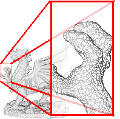

# Contents

- [Recording of this talk](#Recording-of-this-talk)
- [Rational for this Research](#Rational-for-this-Research)
- [Medical Training using VR](#Medical-Training-using-VR)
- [Need for a Simulation Library that is ...](#Need-for-a-Simulation-Library-that-is)
- [In a nutshell, gVirtualXray is ...](#In-a-nutshell-gVirtualXray-is)
- [Fact sheet](#Fact-sheet)
- [Simulation functionalities](#Simulation-supports)
- [Recent developments](#More-recently)
- [Applications of gVirtualXRay](#Applications-of-gVirtualXRay)

# Recording of this talk

# Rational for this Research

- Simulation of X-Ray attenuation extensively studied in physics;
- Different physically-based simulation code available;
- Physically-based simulation usually performed using Monte Carlo methods on CPU (often used in dosimetry for radiotherapy);
    - Very accurate; but
    - Computing an image requires a very very very long time (e.g. days or weeks);
- Ray-tracing is an alternative, but
    - Still relatively slow on CPU;
    - Does not easily take into account scattering;
        - Scattering does not necessarily matter in X-ray transmission imaging;
    - Does not include Poisson counting noise;
        - Poisson noise can be added as a post-process.

# Medical Training using VR

- PhD (start 2003) and Postdoc (start 2006) in medical VR;
- Development of VR apps to train Interventional radiologists;
    - Stick needles and catheters in the human body whilst looking at images
    - Such as fluoroscopy;
    - Real-time X-ray images on a TV screen.
- Not interested in scattering;
- Noise is not an issue;
- Ray-tracing is viable in this context.

# Need for a Simulation Library that is

- Open-source (with a flexible license)
    - Can be used in open-source projects
    - Can be used in closed source commercial applications too
- Fast
    - GPU implementation.
- Flexible
    - Available for most popular programming languages
- Cross platform
    - Run on GNU/Linux, Mac OS X and Windows
- Validated

# In a nutshell, gVirtualXray is

- a C++ X-Ray simulation library
- Open source;
- Realtime;
- Portable;
- Validated;
- Available for many programming languages.

# Fact sheet

- SVN repository hosted by 
- Implemented in  using 
<!-- - Can also be deployed in  applications; -->
- Cross-platform, the library works on
    - Windows, GNU/Linux, and Mac OS X,
    - Nvidia and AMD graphics cards,
    - Integrated GPUs,
    - Desktop PCs and Laptops.
<!-- - Provides real-time performance; -->
- Is accurate (quantitative validation);
- Enable reproducible research;
- Supports [: Photon Cross Sections Database](https://physics.nist.gov/PhysRefData/Xcom/html/xcom1.html) from ;
- Uses polygon meshes to model 3-D geometries from popular file formats (eg. STL, PLY, 3DS, OBJ, DXF, X3D, DAE)

# Simulation supports:

- Various source shapes
    - Point source;
    - Cube source;
    - Parallel beam.
- Incident beams:        
    - Monochromatic;
    - Polychromatic.
- Geometries:
    - Surface meshes (triangles);
    - Volume meshes (tetrahedrons). **NEW**
- Material properties:
    - Chemical elements (e.g. W for tungsten);
    - Compounds (e.g. H2O for water); **NEW**
    - Mixture (e.g. Ti90/Al6/V4); **NEW**
    - Hounsfield units (for medical applications).

# More recently

- Improved installation from source code.
- Converter from Abaqus files 2 STL files: **NEW**
    - The simulation works with volumetric meshes (tetrahedrons),
    - With surface meshes (triangles)
- Always working on improvements (when time allows)
    - Currently working on the deployment on SuperComputing Wales. **work-in-progress**
    - Port to Vulkan? **work-in-progress**
    - Maybe one day, a Matlab wrapper?

# Applications of gVirtualXRay

- [Teaching particle physics to undergraduates](https://doi.org/10.1088/1361-6404/ab5011);
- Virtual Reality Simulation;
- [Virtual Testing Lab](https://doi.org/10.5281/zenodo.1452506)
- [Design new clinical imaging modality to reduce dose exposure](https://doi.org/10.1109/ACCESS.2019.2895925)
- [Teaching radiography in medicine](https://doi.org/10.2312/cgvc.20191267)

# Back to main menu

[Click here](../README.md)
