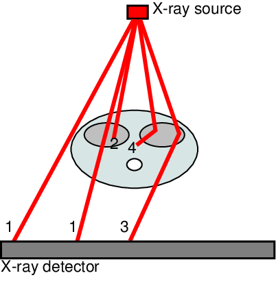
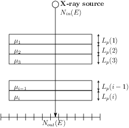

# X-photons/matter Interactions (1/2)

- X-photons cross matter;
- During their path into any material, they can interact with matter.

1. Directly transmitted photons (no interaction);
2. Absorbed photons;
3. Scattered photons;
4. Absorbed scattered photons.

# X-photons/matter Interactions (2/2)

**For most X-rays imaging modalities, only directly transmitted photons are essential:**

- Scattered photons decrease the image quality;
- Absorbed photons do not reach the detector;
- Scattered photons may be ignored (but not necessarily).

1. Directly transmitted photons (no interaction);
2. Absorbed photons;
3. Scattered photons;
4. Absorbed scattered photons.

# Beer-Lambert Law (Attenuation Law)

- Nout(E) = Nin(E) e(-&Sigma;i &mu;i(E,&rho;,Z) Lp(i))
  - Nin(E) the number of incident photons at energy E;
  - Nout(E) the number of transmitted photons of energy E;
  - &mu;i the linear attenuation coefficient (in cm-1) of the ith object. It depends on:
    - E the energy of incident photons;
    - &rho; the material density of the object;
    - Z the atomic number of the object material.
  - Lp(i) the path length of the ray in the ith object.
- Eout = Nout(E) x E
  - Eout the energy received by the pixel, i.e. as recorded in the X-ray image.

# Example (monochromatic case)

[http://gvirtualxray.sourceforge.net/validation/validation_03/beer_lambert_law_monochromatic.php](http://gvirtualxray.sourceforge.net/validation/validation_03/beer_lambert_law_monochromatic.php)

# Beer-Lambert Law in the polychromatic case

- There are more than one energy in the incident beam spectrum
- Just iterate over the energy channels:

Eout = &Sigma;j Ej x Nout(Ej)

Eout = &Sigma;j Ej x Nin(Ej) e(-&Sigma;i &mu;i(Ej,&rho;,Z) Lp(i))

with j the j-th energy channel

# Example (polychromatic case)

[http://gvirtualxray.sourceforge.net/validation/validation_05/beer_lambert_law_polychromatic.php](http://gvirtualxray.sourceforge.net/validation/validation_05/beer_lambert_law_polychromatic.php)

# Back to main menu

[Click here](../README.html#(2))
