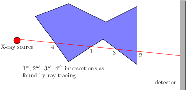
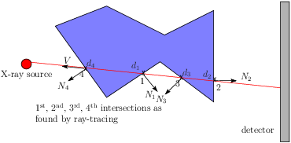
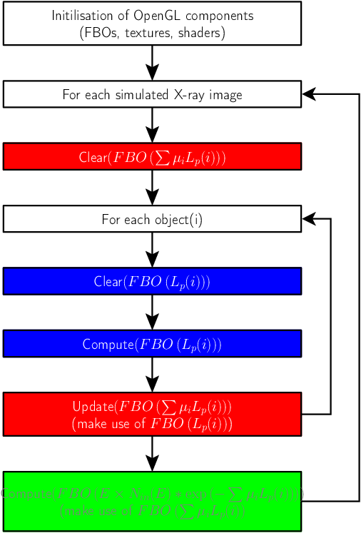
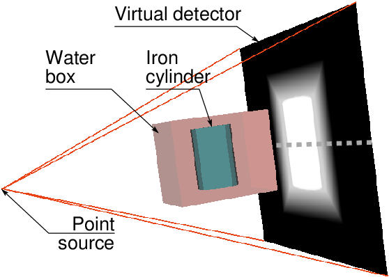
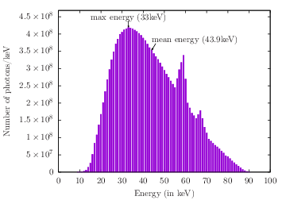
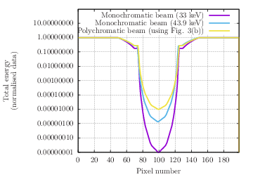
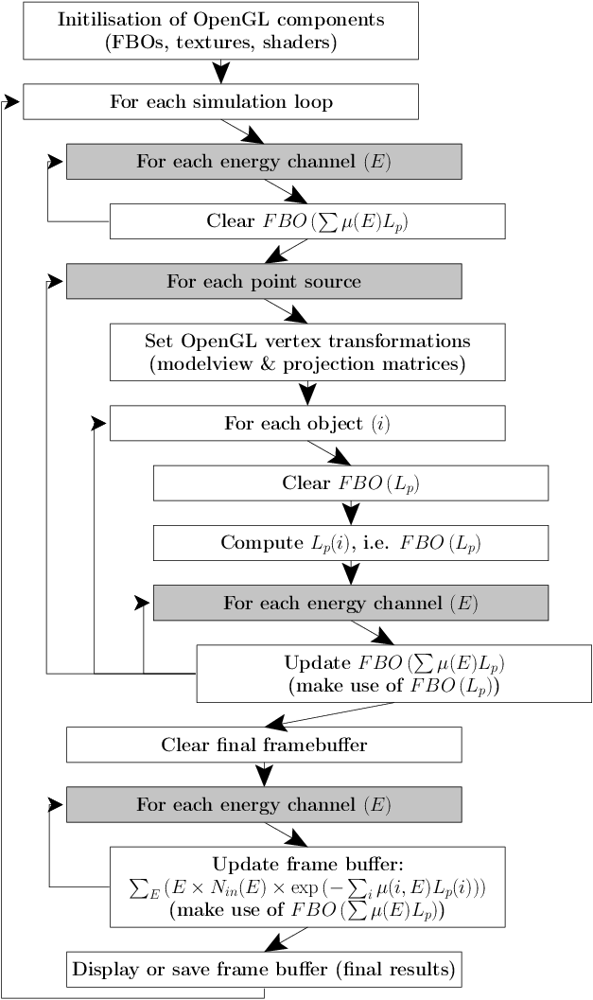

# Contents

- [Recording of this talk](#Recording-of-this-talk)
- [Path Length: Naive Approach](#Path-Length:-Naive-Approach)
- [Path Length: L-Buffer](#Path-Length-L-Buffer)
- [L-Buffer Implementation](#L-Buffer-Implementation)
- [Multipass Rendering Pipeline](#Multipass-Rendering-Pipeline)
- [Adding the Beam Spectrum](#Adding-the-Beam-Spectrum)
- [Simulation with Different Source Shapes](#Simulation-with-Different-Source-Shapes)
- [Final Simulation Flowchart](#Final-Simulation-Flowchart)
- [Bibliography (links)](#Bibliography-links)

# Recording of this talk

# Path Length: Naive Approach

1. Detect every intersection between a ray and the objects;
2. Sort intersection
(Can be handled by GPUs using depth-peeling, a multi-pass rendering technique for semi-transparent polygonal objects without sorting polygons);
3. Compute path length.

# Path Length: L-Buffer

**Intersection sorting is actually not needed!**

- By convention normals are outward;
- A ray penetrates into an object when the dot product between the view vector (V) and the normal (Ni) at the intersection point is positive;
- It leaves an object when the dot product is negative.

# L-Buffer Implementation

Lp=&Sigma;i - sng(V &middot; Ni) x di

- i refers to ith intersection in an arbitrary order;
- di distance from X-ray source to intersection point;
- sgn(V &middot; Ni) stands for the sign of the dot product between V and Ni;
- In a shader program, compute:
    - sgn(V &middot; Ni);
    - di the distance between the X-ray source and the intersection;
    - Assign -sng(V &middot; Ni) x di as the fragment value.
- For each pixel, compute Lp thanks to high-dynamic range and OpenGL blending function (pixel values may not be between 0 and 1).

*See [http://dx.doi.org/10.2312/LocalChapterEvents/TPCG/TPCG09/025-032](DOI: 10.2312/LocalChapterEvents/TPCG/TPCG09/025-032) for more details.*

# Multipass Rendering Pipeline

pixel = E x Nout

pixel =  E x Nin(E) e(-&Sigma;i &mu;i    Lp(i))

- Needs 3 FBOs with high-dynamic range capability for off-line rendering:

- For each object of the scene:
  1. Compute Lp(i);
  2. Update results of &Sigma; &mu;i Lp(i).
- For the final image only:
  1. Compute Nout;
  2. (Optional when direct display only is needed).

# Adding the Beam Spectrum

- Take into the different energies within the incident beam;
- This is known as *beam hardening*;
- Iterate over several energy channels:
  - pixel = &Sigma;j Ej x Nout(Ej)
  - pixel = &Sigma;j Ej x Nin(Ej) e(-&Sigma;i &mu;i(Ej,&rho;,Z) di)

- Example:

# Simulation with Different Source Shapes

- Take into account the focal spot of the X-ray source;
- Iterate over several point sources within the volume of the focal spot:
  - pixel = &Sigma;k &Sigma;j Ej x Nin(Ej) e(-&Sigma;i &mu;i(Ej,&rho;,Z) di(k))
  - See blur in the corresponding image below.

| Parallel beam             |  Infinitely small point source | 13mm source |
:-------------------------:|:-------------------------:|:-------------------------:
 |     |   
 | | 

# Final Simulation Flowchart

- Iterate over several energy channels: Three extra for loops;
- Iterate over several point sources within the volume of the focal spot: One extra for loop.

# Bibliography (links)

- [DOI: 10.2312/LocalChapterEvents/TPCG/TPCG09/025-032](http://dx.doi.org/10.2312/LocalChapterEvents/TPCG/TPCG09/025-032)
- [DOI: 10.1007/s11548-009-0367-1](http://dx.doi.org/10.1007/s11548-009-0367-1)
- [DOI: 10.2312/egp.20101026](http://dx.doi.org/10.2312/egp.20101026)
- [DOI: 10.1016/j.compmedimag.2015.12.002](https://doi.org/10.1016/j.compmedimag.2015.12.002)

# Back to main menu

[Click here](../README.md)
