# Contents

- [Recording of this talk](#Recording-of-this-talk)
- [Quantitative Validation](#Quantitative-Validation)
- [Density for Different Materials (human tissues) from the Literature](#Density-for-Different-Materials-human-tissues-from-the-Literature)
    - [Mass Attenuation Coefficients](#Mass-Attenuation-Coefficients)
    - [Mass Attenuation Coefficients: Tissue, Soft (ICRU-44)](#Mass-Attenuation-Coefficients-Tissue-Soft-ICRU-44)
    - [Mass Attenuation Coefficients: Bone, Cortical (ICRU-44)](#Mass-Attenuation-Coefficients-Bone-Cortical-ICRU-44)
- [More testing](#More-testing)
    - [Test case](#Test-case)
    - [Beer-Lambert Law: Polychromatism Case](#Beer-Lambert-Law-Polychromatism-Case)
    - [Gate vs. gVirtualXRay](#Gate-vs-gVirtualXRay)
        - [Point Source](#Gate-vs-gVirtualXRay-Point-Source)
        - [Uncentered Source](#Gate-vs-gVirtualXRay-Uncentered-Source)
        - [Cube Source](#Gate-vs-gVirtualXRay-Cube-Source)
- [Unit tests](#Unit-tests)

# Recording of this talk

# Quantitative Validation

- Simulating an image relies on a Beer-Lambert law implementation;
- Solving the Beer-Lambert law relies on Linear Attenuation Coefficients; (&mu;)
- &mu; is not known for given incident energies;
- &mu; is computed using Mass Attenuation Coefficients (&mu;/&rho;) and material density (&rho;).
- **Are the values used in gVirtualXRay accurate?**
    - Compare values computed in gVirtualXRay with those from the literature.
- **Are the Beer-Lambert law implementations accurate?**
    - Compare values computed in gVirtualXRay with theoretical ones.
- **Are the simulated images accurate?**
    - Compare images computed using gVirtualXRay with those using a state-of-the-art Monte Carlo software, e.g.

    

# Density for Different Materials (human tissues) from the Literature
*](img/rho_reference.png)

# Density for Different Materials (human tissues) computed by gVirtualXRay

*](img/figure5b.png)

# Mass Attenuation Coefficients

- Any tissue can be described by its Hounsfiled Unit (HU):
  - HU(material) = 1000 x (&mu;(material) - &mu;(water)) / &mu;(water)
- Given a HU value for any simulated object;
  - If &mu;(water) is known for any energy,
  - then &mu;(material) for any HU and for any energy can be computed:
    - &mu;(material, E) = &mu;(water, E) x (1 + HU(material)/1000)
- 	Mass attenuation coefficients (&mu;/&rho;) for various human tissues can be found in the literature;
- 	The density (&rho;) for various human tissues can be found in the literature.
- **Linear attenuation coefficients can therefore be computed for various human tissues** and
- **used to solve the Beer-Lambert law**

# Mass Attenuation Coefficients: Tissue, Soft (ICRU-44)

- *](img/tissue.png)

- &mu;(water) from literature is provided at given energies only: Interpolation needed for missing energies

  - 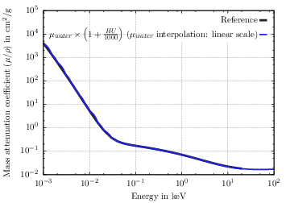

  - 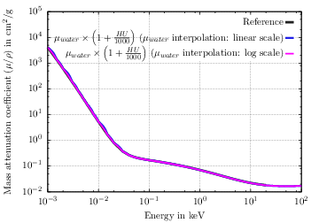

# Mass Attenuation Coefficients: Bone, Cortical (ICRU-44)

- *](img/bone.png)

- &mu;(water) from literature is provided at given energies only: Interpolation needed for missing energies

  - 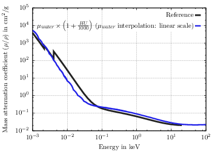

  - 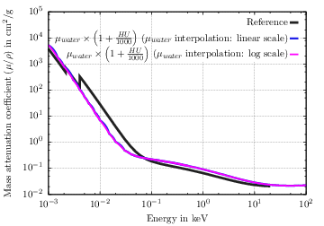

**Not a good match as the peaks are not visible in &mu;(water)**

- 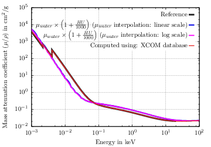

**This is now a good match**

# Going back to previous slide

- Simulating an image relies on a Beer-Lambert law implementation;
- Solving the Beer-Lambert law relies on Linear Attenuation Coefficients; (&mu;)
- &mu; is not known for given incident energies;
- &mu; is computed using Mass Attenuation Coefficients (&mu;/&rho;) and material density (&rho;).
- **Are the values used in gVirtualXRay accurate?**
    - Compare values computed in gVirtualXRay with those from the literature.

# Going back to previous slide

- Simulating an image relies on a Beer-Lambert law implementation;
- Solving the Beer-Lambert law relies on Linear Attenuation Coefficients; (&mu;)
- &mu; is not known for given incident energies;
- &mu; is computed using Mass Attenuation Coefficients (&mu;/&rho;) and material density (&rho;).
- **Are the values used in gVirtualXRay accurate?**
    - Compare values computed in gVirtualXRay with those from the literature.
    - **YES**

# More testing

- **Are the Beer-Lambert law implementations accurate?**
    - Compare values computed in gVirtualXRay with theoretical ones.
- **Are the simulated images accurate?**
    - Compare images computed using gVirtualXRay with those using a state-of-the-art Monte Carlo software, e.g.

    

# Test case

- Simulated object

  

  - Cube: edge length of 3 cm, made of soft tissue (HU = 52).
  - Cylinder: height of 3 m, diameter of 2 cm, made of bone (HU = 1330).
- Incident beam:

| N: number of photons | E: energy (in MeV) |
|----------------------|--------------------|
| 10                   | 0.1                |
| 20                   | 0.2                |
| 10                   | 0.3                |

# Beer-Lambert Law: Polychromatism Case

- Use material properties from the literature;
- The energy, Iout, (in MeV) transmitted orthogonally throw the middle of cube and cylinder should be:
  - Iout = Iout(0.1) + Iout(0.2) + Iout(0.3), with
  - Iout(0.1) =    10 x 0.1 x e-( 3.346E-01 x 2 + 1.799E-01 x 1)
  - Iout(0.2)  =    10 x 0.1 x e-( 2.361E-01 x 2 + 1.443E-01 x 1)
  - Iout(0.3)  =    10 x 0.1 x e-( 2.008E-01 x 2 + 1.249E-01 x 1)
  - Iout = 4.359
- On GPU, the energy, Ioutgpu, is: 4.353.
   - The relative error is:
   - |Iout - Ioutgpu| / Iout = 0.1&percnt;

# Gate vs. gVirtualXRay

We simulate a test case twice:

- Using a Monte Carlo method for particle physics implemented in [GATE](http://www.opengatecollaboration.org/);
- Using our GPU implementation.

*GATE is an opensource software developed by an international collaboration. Its focus is on Monte Carlo simulation in medical imaging and radiotherapy. GATE makes use of the Geant4 libraries. Geant 4 is CERN's Monte Carlo simulation platform dedicated to particle physics in nuclear research. CERN is the European Organization for Nuclear Research.*

# Gate vs. gVirtualXRay: Point Source

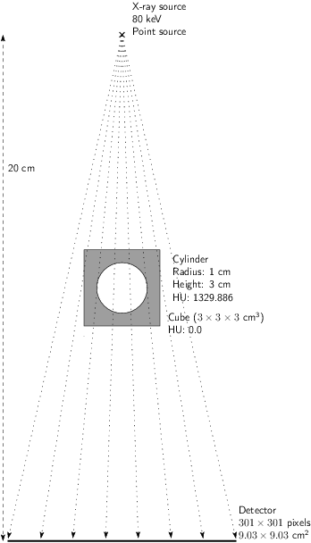

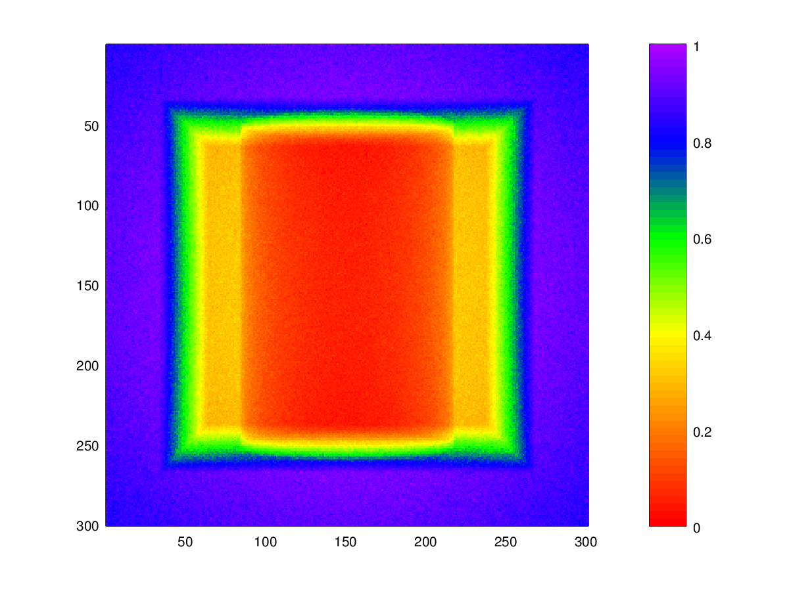

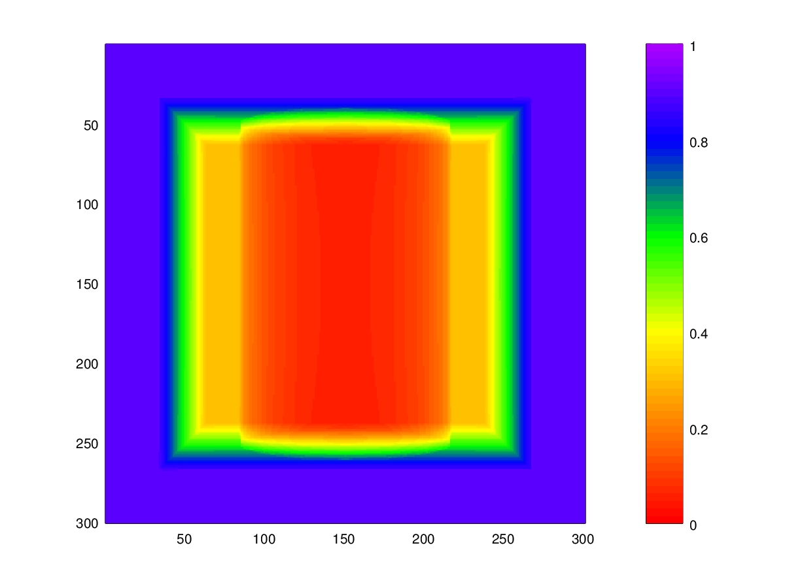

Normalised cross-correlation (NCC) = 99.747&percnt;

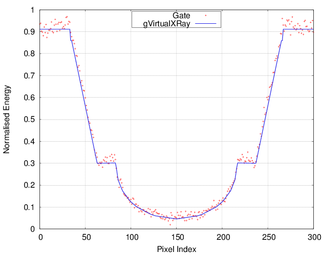

# Gate vs. gVirtualXRay: Uncentered Source

The source is translated by a vector: -5.0 0.5 0.5 cm

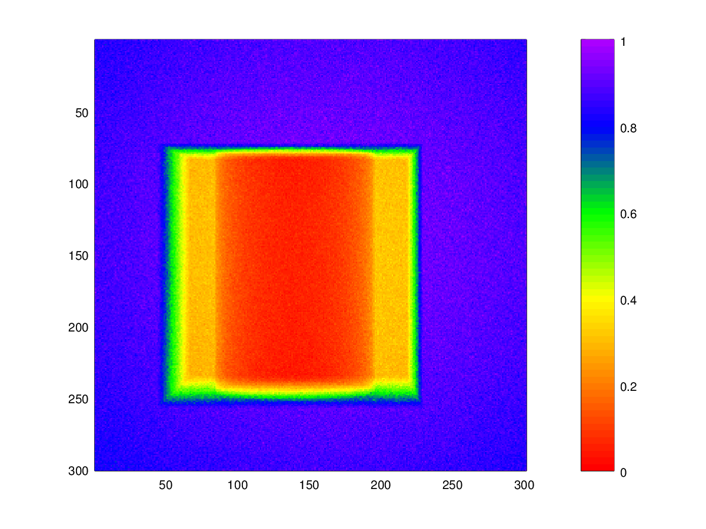

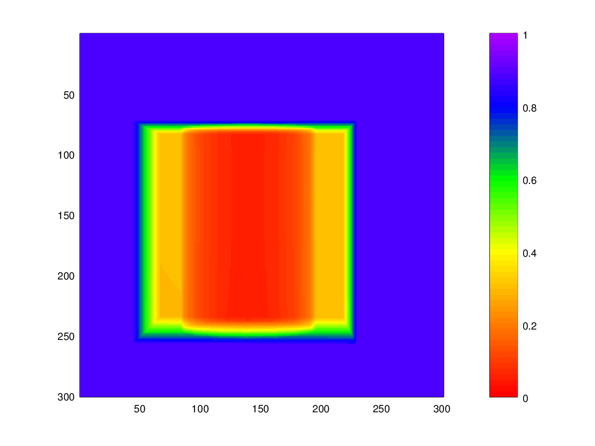

Normalised cross-correlation (NCC) = 99.656&percnt;

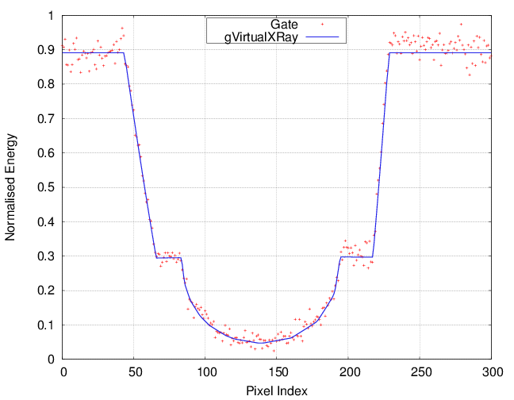

# Gate vs. gVirtualXRay: Cube Source

The source is a 1x1x1 cm cube.

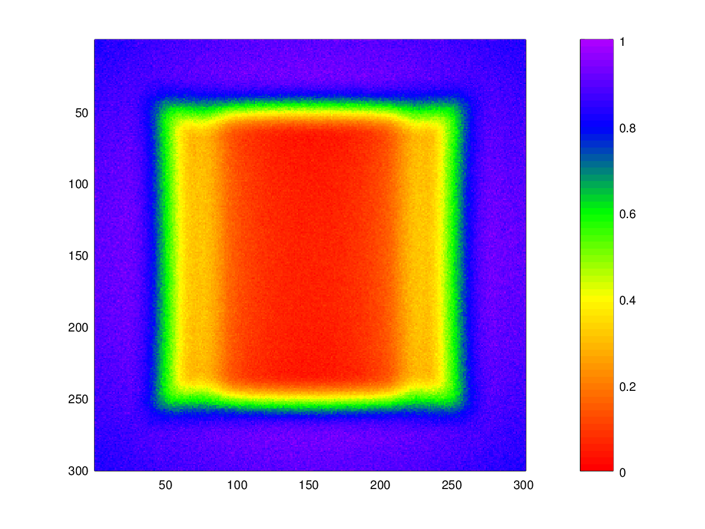

Normalised cross-correlation (NCC) = 99.743&percnt;

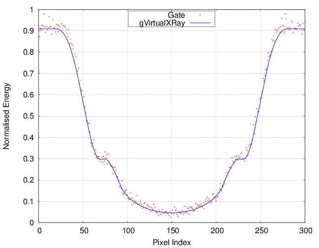

# Unit tests

- More validation test available, see [http://gvirtualxray.sourceforge.net/validation/validation_tests.php](http://gvirtualxray.sourceforge.net/validation/validation_tests.php)
- To check that your system provides the results you expect,
- Run the unit tests
  - See next topic

# Back to main menu

[Click here](../README.md)
