# Contents

- [Recordings of this talk](#Recordings-of-this-talk)
- [Requirements](#requirements)
    - [For GNU/Linux](#for-gnulinux)
    - [For Mac OS X](#for-mac-os-x)
    - [For Microsoft Windows](#for-microsoft-windows)
- [Installation from the source code](#installation-from-the-source-code)
    - [Download the latest version of the source code](#download-the-latest-version-of-the-source-code)
    - [GNU/Linux and Mac OS X](#gnulinux-and-mac-os-x)
    - [For Windows](#for-windows)
    - [Test the Python wrapper](#test-the-python-wrapper)
    - [For SuperComputing Wales](#for-supercomputing-wales)

# Recordings of this talk

- [Click here for a recording (Desktop GNU/Linux)](https://youtu.be/4Rn0HwvhViU)

[](https://youtu.be/4Rn0HwvhViU "Compilation and installation of gVirtualXRay (Desktop GNU/Linux)")

- *Click here for a recording (Supercomputer GNU/Linux)* -- **to appear**

<!-- [](https://youtu.be/??? "Compilation and installation of gVirtualXRay (Supercomputer GNU/Linux)") -->

- [Click here for a recording (MS Windows)](https://youtu.be/9zuvurhKBpY)

[](https://youtu.be/9zuvurhKBpY "Compilation and installation of gVirtualXRay (MS Windows)")

# Requirements

Make sure you have:

- CMake 3.12 or newer (see [http://www.cmake.org/](http://www.cmake.org/));
- A C++ compiler; and
- A GPU that supports OpenGL (integrated GPUs are fine).

## For GNU/Linux

The examples below are for openSUSE Leap but you can adapt them for your own distro.

1. You need cmake and a compiler:
```bash
    $ sudo zypper in cmake-full gcc-c++

```
2. You need some system libraires:
```bash
    $ sudo zypper in libX11-devel \
                     libXi-devel \
                     libXcursor-devel \
                     libXinerama-devel \
                     libXrandr-devel \
                     libXxf86vm-devel \
                     glu-devel
```
3. For unit testing, SimpleGVXR and wrappers (optional):
```bash
    $ sudo zypper in Mesa-libEGL1 Mesa-libEGL-devel libgbm1 libgbm-devel
```
4. For unit wrappers (optional):
```bash
    $ sudo zypper in swig \
        ruby-devel \
        tcl-devel \
        python3 python3-devel \
        java-11-openjdk \
        octave-devel \
        R-core R-base  R-core-devel R-base-devel
```         

## For Mac OS X:

1. Install XCode from the Mac App Store.
2. Install the Command Line Tools package via the Terminal application using
```bash
    $ xcode-select --install command.
```
3. Install CMake from [https://cmake.org/download/](https://cmake.org/download/)
4. For Wrappers, you may want to install SWIG and Python 3. I use homebrew for that purpose, see [https://brew.sh/](https://brew.sh/)

## For Microsoft Windows

1. Install Visual Studio from [https://visualstudio.microsoft.com/vs/](https://visualstudio.microsoft.com/vs/)
    - **Make sure to select the C++ language**
2. Install CMake from [https://cmake.org/download/](https://cmake.org/download/)
3. You may want to install a git client, e.g. [https://git-scm.com/download/win](https://git-scm.com/download/win)
4. You may want to install a SVN client, e.g. TortoiseSVN from [https://tortoisesvn.net/downloads.html](https://tortoisesvn.net/downloads.html)
5. For Wrappers, you may want to install Python 3 from [https://www.python.org/downloads/](https://www.python.org/downloads/) Make sure to install the development libraries.


# Installation from the source code

## Download the latest version of the source code

- The latest release [(gVirtualXRay-1.1.6-Source.zip)](https://sourceforge.net/projects/gvirtualxray/files/1.1/gVirtualXRay-1.1.6-Source.zip/download) available at [https://sourceforge.net/projects/gvirtualxray/files/1.1/gVirtualXRay-1.1.6-Source.zip/download](https://sourceforge.net/projects/gvirtualxray/files/1.1/gVirtualXRay-1.1.6-Source.zip/download) or
- The latest version from SVN at [https://svn.code.sf.net/p/gvirtualxray/code/trunk](https://svn.code.sf.net/p/gvirtualxray/code/trunk)

## GNU/Linux and Mac OS X

Assuming the system is ready.

1. Open a terminal and choose where the binaries should be installed. **It must be a directory where you can write.** If you can't, make sure you use `sudo make` rather than `make` in Steps 5 and 6.
In the example below, I install it in my home directory in `gvxr-install`.
```bash
    $ export GVXR_INSTALL_DIR=$HOME/gvirtualxray-install
```
2. go in the directory where you want to build the gVirtualXRay, e.g.
```bash
    $ mkdir ~/gvxr
    $ cd ~/gvxr
```
3. Download the latest release:
```bash
    $ wget https://sourceforge.net/projects/gvirtualxray/files/1.1/gVirtualXRay-1.1.6-Source.zip/download
    $ mv download gVirtualXRay-1.1.6-Source.zip
    $ unzip gVirtualXRay-1.1.6-Source.zip
```
4. Create a directory where the binaries will be created and go in this directory.
```bash
    $ mkdir gvxr-bin
    $ cd gvxr-bin
```
5. Configure the project using CMake. Use `cmake`, `ccmake` or `cmake-gui` depending on you preferences. `ccmake` and `cmake-gui` are interactive.
    - `cmake`:
```bash
        $ cmake \
            -DCMAKE_BUILD_TYPE:STRING=Release \
            -DCMAKE_INSTALL_PREFIX:STRING=$GVXR_INSTALL_DIR \
            -DBUILD_TESTING:BOOL=ON \
            -DBUILD_WRAPPER_CSHARP:BOOL=ON \
            -DBUILD_WRAPPER_JAVA:BOOL=ON \
            -DBUILD_WRAPPER_OCTAVE:BOOL=ON \
            -DBUILD_WRAPPER_PERL:BOOL=ON \
            -DBUILD_WRAPPER_PYTHON3:BOOL=ON \
            -DBUILD_WRAPPER_R:BOOL=ON \
            -DBUILD_WRAPPER_RUBY:BOOL=ON \
            -DBUILD_WRAPPER_TCL:BOOL=ON \
            -S ../gVirtualXRay-1.1.6 \
            -B $PWD
```
    - `ccmake`:
```bash
        $ ccmake \
            -DCMAKE_BUILD_TYPE:STRING=Release \
            -DCMAKE_INSTALL_PREFIX:STRING=$GVXR_INSTALL_DIR \
            -S .. \
            -B $PWD
```
    - `cmake-gui`:
```bash
        $ ccmake \
            -DCMAKE_BUILD_TYPE:STRING=Release \
            -DCMAKE_INSTALL_PREFIX:STRING=$GVXR_INSTALL_DIR \
            -S .. \
            -B $PWD
```
6. Compile the project.
```bash
    $ make -j16
```
I used a parallel build with 16 jobs as I got 16 cores in my CPU. Adjust `-j` depending on your computer. Once the project is made, it is also installed.
7. Run the unit tests (optional)
```bash
    $ make test
```
8. Install
```bash
    $ make install
```
or at your own risk as `root` using:
```bash
    $ sudo make install
```
If you built the python wrapper, add its path to `PYTHONPATH`:
```bash
    $ PYTHONPATH=$GVXR_INSTALL_DIR/gvxrWrapper-1.0.4/python3:$PYTHONPATH
```
And to make it permanent:
```bash
    $ echo "" >> $HOME/.bashrc
    $ echo "################################################################################" >> $HOME/.bashrc
    $ echo "# Install gvxrPython3 in PYTHONPATH" >> $HOME/.bashrc
    $ echo export PYTHONPATH=$GVXR_INSTALL_DIR/gvxrWrapper-1.0.4/python3:\$PYTHONPATH >> $HOME/.bashrc
    $ echo "################################################################################" >> $HOME/.bashrc
```

### Summary of all the commands:
```bash
export GVXR_INSTALL_DIR=$HOME/gvirtualxray-install

mkdir ~/gvxr
cd ~/gvxr

wget https://sourceforge.net/projects/gvirtualxray/files/1.1/gVirtualXRay-1.1.6-Source.zip/download
mv download gVirtualXRay-1.1.6-Source.zip
unzip gVirtualXRay-1.1.6-Source.zip

mkdir gvxr-bin
cd gvxr-bin

cmake \
    -DCMAKE_BUILD_TYPE:STRING=Release \
    -DCMAKE_INSTALL_PREFIX:STRING=$GVXR_INSTALL_DIR \
    -DBUILD_TESTING:BOOL=ON \
    -DBUILD_WRAPPER_CSHARP:BOOL=OFF \
    -DBUILD_WRAPPER_JAVA:BOOL=OFF \
    -DBUILD_WRAPPER_OCTAVE:BOOL=OFF \
    -DBUILD_WRAPPER_PERL:BOOL=OFF \
    -DBUILD_WRAPPER_PYTHON3:BOOL=ON \
    -DBUILD_WRAPPER_R:BOOL=OFF \
    -DBUILD_WRAPPER_RUBY:BOOL=OFF \
    -DBUILD_WRAPPER_TCL:BOOL=OFF \
    -S ../gVirtualXRay-1.1.6 \
    -B $PWD

make -j16

make test

make install

export PYTHONPATH=$GVXR_INSTALL_DIR/gvxrWrapper-1.0.4/python3:PYTHONPATH

echo "" >> $HOME/.bashrc
echo "################################################################################" >> $HOME/.bashrc
echo "# Install gvxrPython3 in PYTHONPATH" >> $HOME/.bashrc
echo "PYTHONPATH=$GVXR_INSTALL_DIR/gvxrWrapper-1.0.4/python3:\$PYTHONPATH" >> $HOME/.bashrc
echo "################################################################################" >> $HOME/.bashrc

```

### Installation directory content in GNU/Linux and Mac OS X

On Unixes, you Should see 3 or 4 directories in the installation directory depending on wrappers:

- third_party
  - include
  - lib (Windows and Mac OS X) or lib64 (GNU/Linux)
- gVirtualXRay-1.1.6
  - Bin2C.cmake
  - CreateHeaderFiles.cmake
  - gVirtualXRayConfig.cmake
  - include
  - lib
  - LICENSE.txt
  - test
  - third_party
  - UsegVirtualXRay.cmake
- SimpleGVXR-1.0.4
  - include
  - lib
  - SimpleGVXR-doc.i
  - SimpleGVXRConfig.cmake
  - test
  - UseSimpleGVXR.cmake
- gvxrWrapper-1.0.4
  - data
  - python3


## For Windows

I recommand to use **64 bits** for all the components, including for **Python 3**.

1. Download and extract gVirtualXRay's code from [https://sourceforge.net/projects/gvirtualxray/files/1.1/gVirtualXRay-1.1.6-Source.zip/download](https://sourceforge.net/projects/gvirtualxray/files/1.1/gVirtualXRay-1.1.6-Source.zip/download).
2. Open CMake's gui.

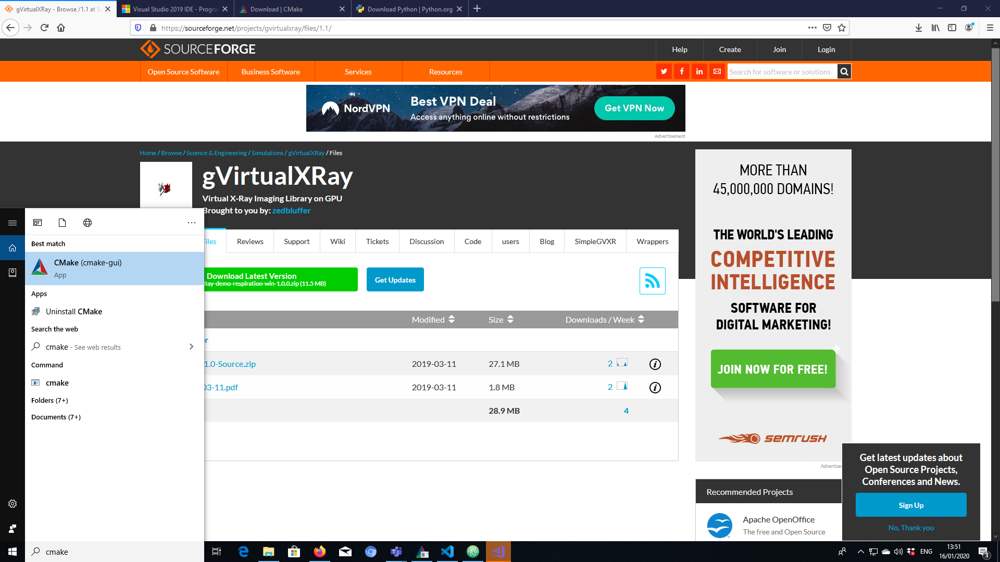

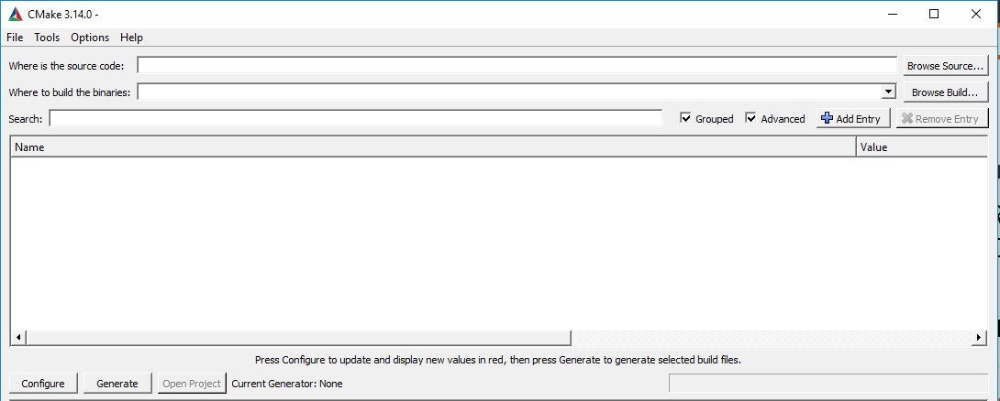

3. Select where the source code is. This is the top directory of the repository that contains CMakeLists.txt.

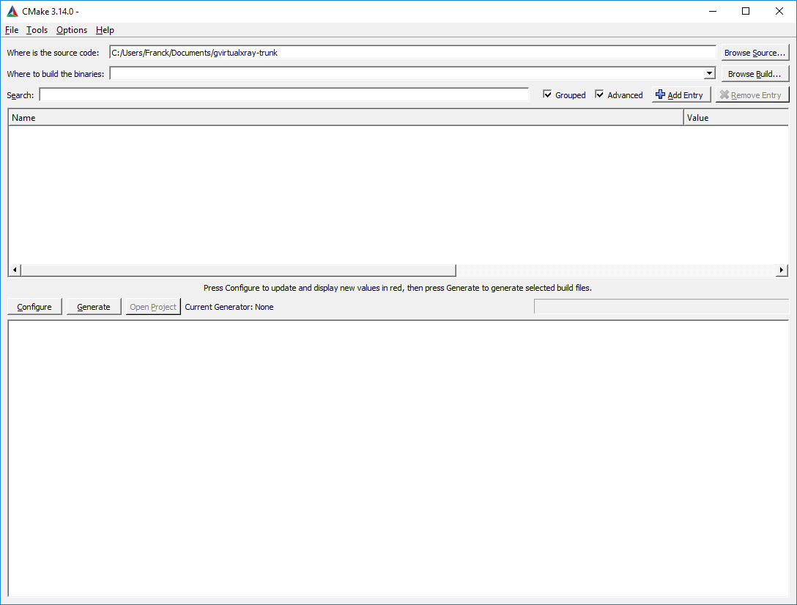

4. Select where the binaries are going to be compiled. It CANNOT be a sub-directory of the source directory chosen in the previous step.

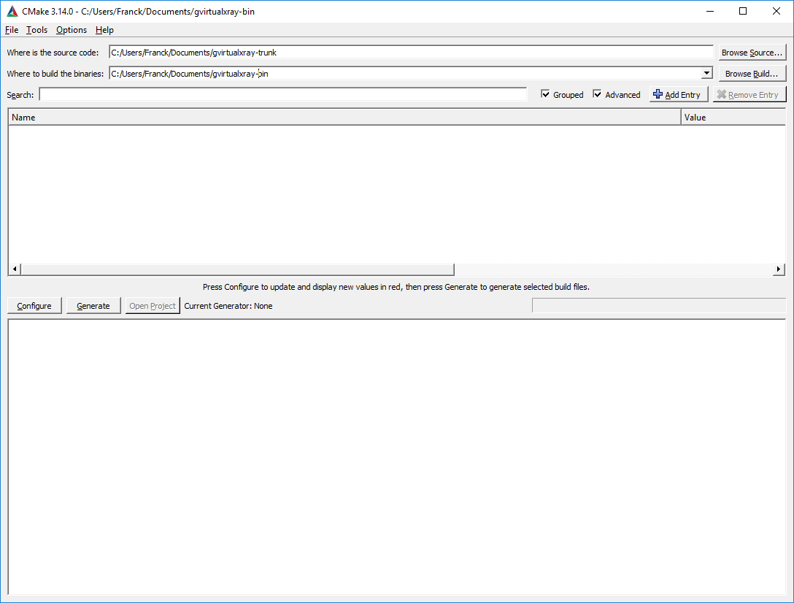

5. Press configure, then choose which compiler you want to use and which architecture. I used Visual Studio 15 2017's native compilers, and x64 (for 64 bits).

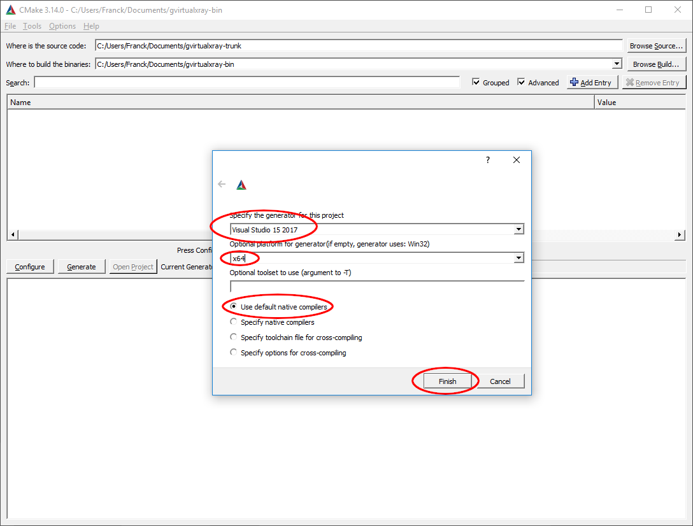

6. Click on `Configure`. There'll be an error, but don't worry about it.

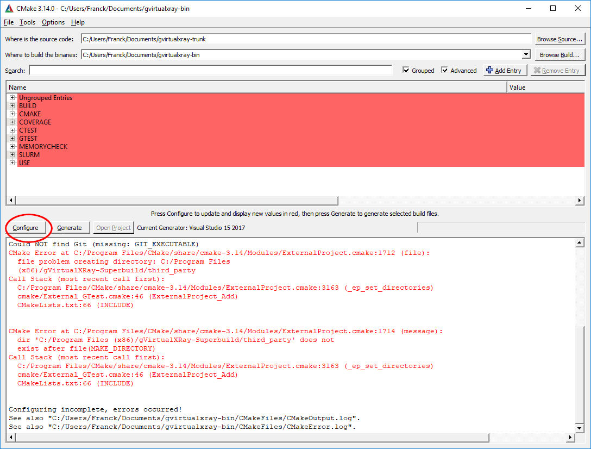

7. Search for `install`.

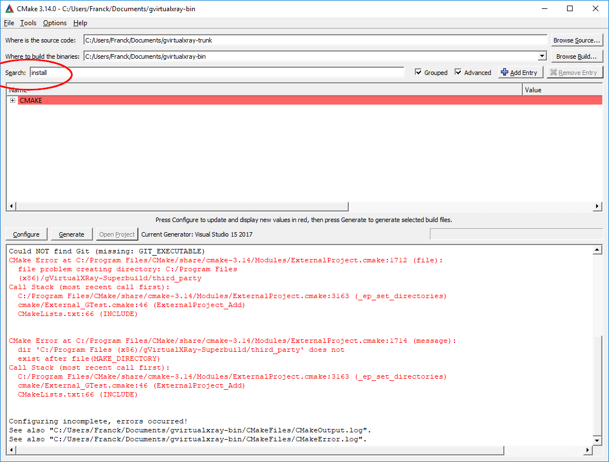

8. Change the variable `CMAKE_INSTALL_PREFIX` into a path where you are allowed to write. Click on configure. If it does not work, change the path and make sure you have write privilege for that path.

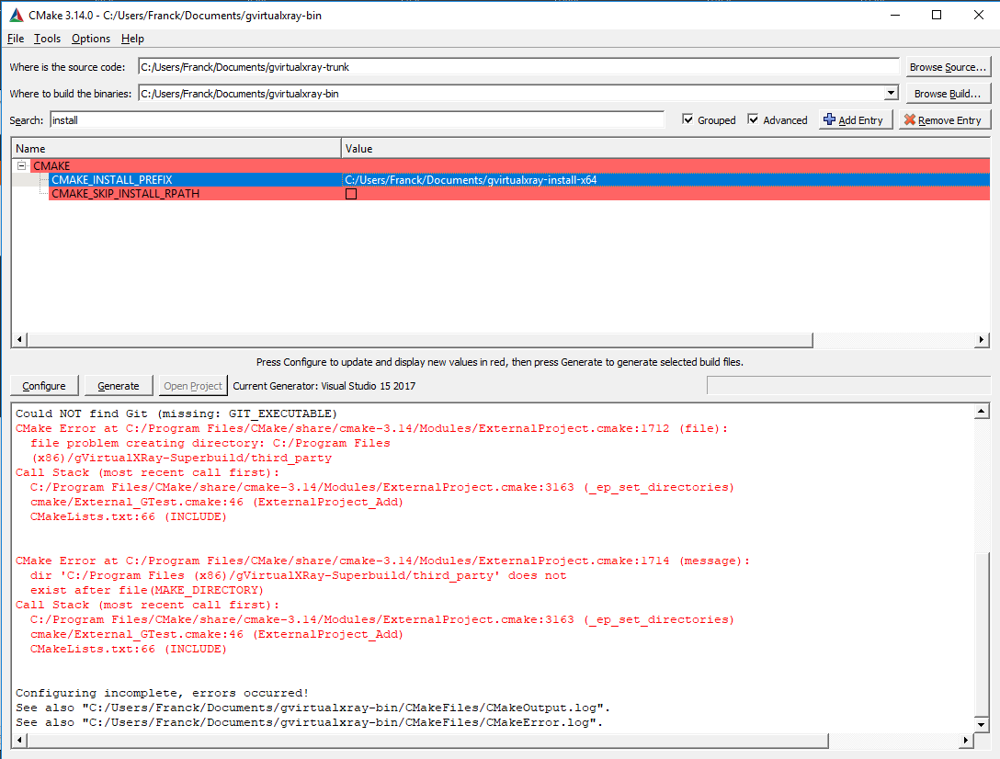

9. If you want to build a wrapper, e.g. for Python 3, go to `BUILD` and tick the right option(s) (in my case `BUILD_PYTHON£_WRAPPER`). Now you can click on `Configure`, then `Generate`, then `Open Project`.


10. It will open Visual Studio. Change Debug into Release.

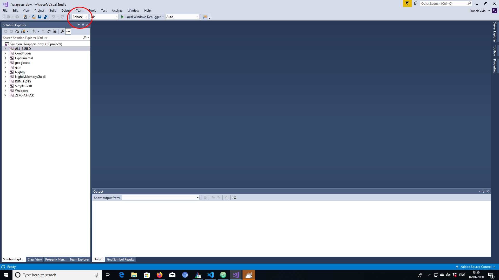

11. Do a right click on `BUILD_ALL` or press the `F7` key to build the project.


12. Go and make some coffee, it's gonna take a bit of time...
At the end, in the output, you should see something like
```
========== Build: 4 succeeded, ...
```


### Installation directory content in Windows

On Windows, you Should see 4 or 5 directories in the installation directory depending on wrappers:

- bin
- third_party
  - include
  - lib (Windows) or lib64 (GNU/Linux and Mac OS X???)
- gVirtualXRay-1.1.6
  - Bin2C.cmake
  - CreateHeaderFiles.cmake
  - gVirtualXRayConfig.cmake
  - include
  - lib
  - LICENSE.txt
  - test
  - third_party
  - UsegVirtualXRay.cmake
- SimpleGVXR-1.0.4
  - include
  - lib
  - SimpleGVXR-doc.i
  - SimpleGVXRConfig.cmake
  - test
  - UseSimpleGVXR.cmake
- gvxrWrapper-1.0.4
  - data
  - python3


## Test the Python wrapper

1.  Go to `gvxrWrapper-1.0.4/python3`,
2. Execute the test script. You should see something like:

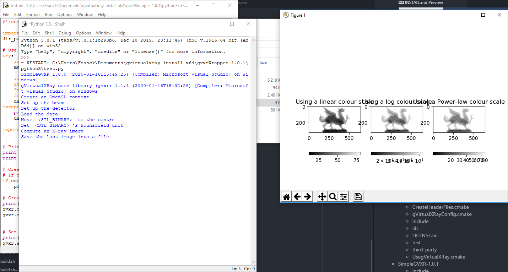
The X-ray image is displayed using linear, log and power law colour scales using Matplotlib.

3. Press `<Q>` to close this window and the real-time viewer will open:

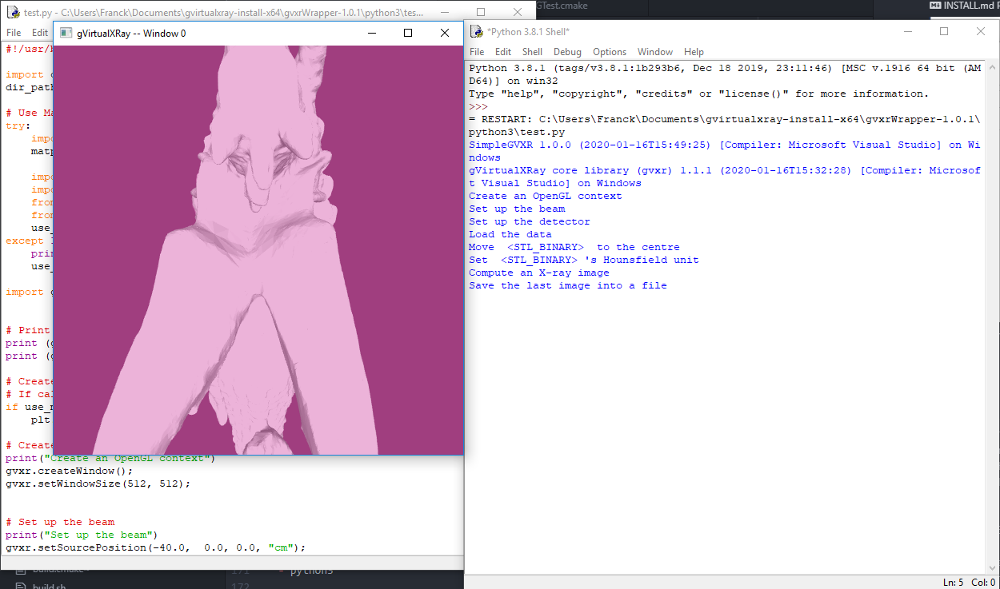

4. Use the mouse wheel to zoom-out:

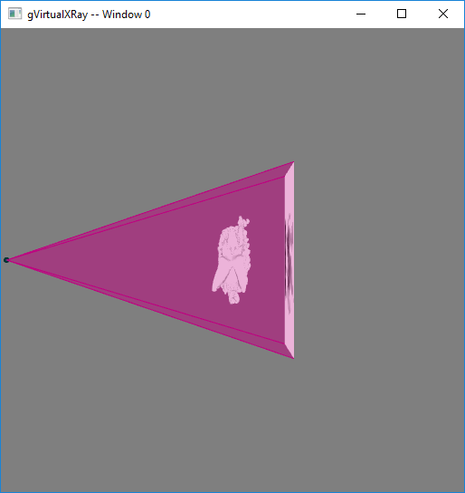

5. Use the mouse left button and move the mouse around to adjust the view:

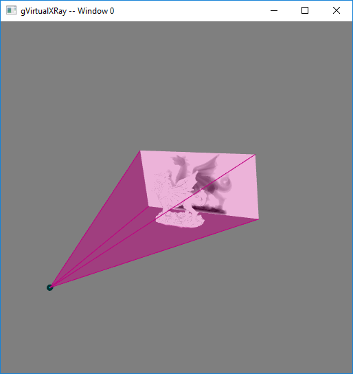

6. Press `<B>` to hide/show the X-ray beam:

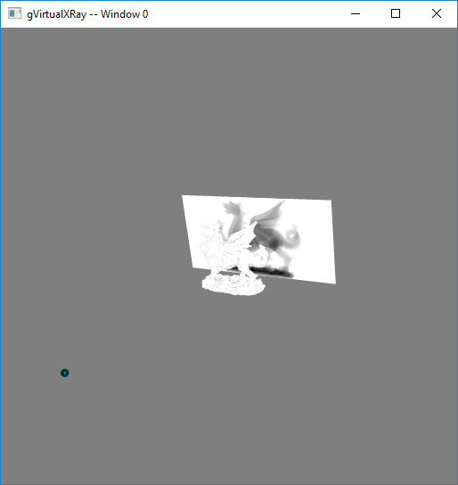

7. Press `<W>` to view the 3-D object in solid/wireframe mode:

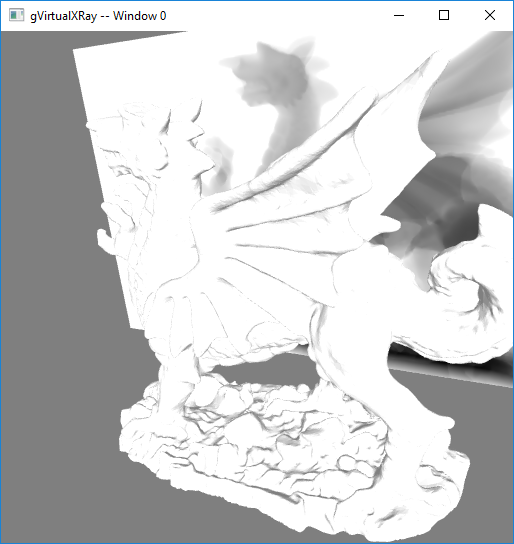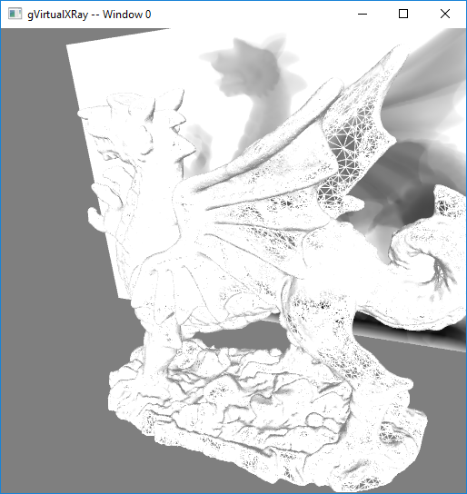

8. You can also press `<N>` to display the X-ray image in negative or positive and `<H>` to hide/show the X-ray detector.
9. Press `<Q>` or `<ESC>` to exit. When the script ends, there'll be two new files:

- `xray_image-0.mha`: contains the X-ray image. MHA fies can be viewed with the popular scientific image viewer tool [ImageJ/Fiji](https://imagej.net/Fiji/).
- `lbuffer-0.mha`: contains the length of X-rays crossed in the 3-D object.
10. If you want to create your own simulations, have a look at the script. You can find it at [https://sourceforge.net/p/gvirtualxray/code/HEAD/tree/trunk/Wrappers/python3/test.py](https://sourceforge.net/p/gvirtualxray/code/HEAD/tree/trunk/Wrappers/python3/test.py).

## For SuperComputing Wales

1. Open a terminal, log on SCW using SSH, and choose where the binaries should be installed. **It must be a directory where you can write.**.
In the example below, I install it in my home directory in `gvxr-install`.
```bash
    $ export GVXR_INSTALL_DIR=$HOME/gvirtualxray-install
```
2. Load the SCW modules
```bash
    $ module load cmake compiler/gnu/8/1.0 python/3.7.0
```
3. Download, compile and install SWIG
```bash
    $ wget https://sourceforge.net/projects/swig/files/swig/swig-4.0.2/swig-4.0.2.tar.gz/download
    $ tar zxfp download
    $ rm download
    $ cd swig-4.0.2/
    $ ./configure --prefix=$HOME/install
    $ make -j8
    $ make install
    $ export SWIG_DIR=$HOME/install/share/swig/4.0.2/
    $ cd ..
```
4. go in the directory where you want to build the gVirtualXRay, e.g.
```bash

    $ mkdir ~/gvxr
    $ cd ~/gvxr
```
5. Download the latest release:
```bash
    $ wget https://sourceforge.net/projects/gvirtualxray/files/1.1/gVirtualXRay-1.1.4-Source.zip/download
    $ mv download gVirtualXRay-1.1.4-Source.zip
    $ unzip gVirtualXRay-1.1.4-Source.zip
```
4. Create a directory where the binaries will be created and go in this directory.
```bash
    $ mkdir gvxr-bin
    $ cd gvxr-bin
```
5. Configure the project using CMake:
```bash
    $ cmake \
        -DCMAKE_BUILD_TYPE:STRING=Release \
        -DCMAKE_INSTALL_PREFIX:STRING=$GVXR_INSTALL_DIR \
        -DBUILD_TESTING:BOOL=ON \
        -DSWIG_DIR=$SWIG_DIR \
        -DSWIG_EXECUTABLE=$HOME/install/bin/swig \
        -DBUILD_WRAPPER_PYTHON3:BOOL=ON \
        -DPYTHON_LIBRARY=/apps/languages/python/3.7.0/el7/AVX512/gnu-8.1/lib/libpython3.so \
        -DPYTHON_LIBRARY_DEBUG=/apps/languages/python/3.7.0/el7/AVX512/gnu-8.1/lib/libpython3.so \
        -DPYTHON_LIBRARY_RELEASE=/apps/languages/python/3.7.0/el7/AVX512/gnu-8.1/lib/libpython3.so \
        -S ../gVirtualXRay-1.1.4 \
        -B $PWD
```
6. Compile the project.
```bash
    $ make -j4
```
7. Run the unit tests (optional)
You cannot run the unit test on the supercomputer's login node. You need to use a compute node with a GPU. Write the following script (`unit_test_job.sh`) and submit it with `sbatch`.

  - Content of `unit_test_job.sh`:

```bash
#!/usr/bin/env bash
#
# Project/Account (use your own)
#SBATCH -A YOURACCOUNT
#SBATCH --job-name=unit_test     # Job name
#SBATCH --output unit_test-%j.out     # Job name
#SBATCH --error unit_test-%j.err     # Job name
#
# We ask for 1 tasks with 1 core only.
# We ask for a GPU
#SBATCH --gres=gpu:2
#SBATCH -p gpu_v100
#
# Number of tasks per node
#SBATCH --ntasks-per-node=1
#
# Number of cores per task
#SBATCH --cpus-per-task=1
#
# Use one node
#SBATCH --nodes=1
#
# Runtime of this jobs is less then 5 minute.
#SBATCH --time=00:00:05
module purge > /dev/null 2>&1
module load cmake compiler/gnu/8/1.0 python/3.7.0

export EGL_PLATFORM=
make test
```

  - Submit the job:

```bash
    sbatch unit_test_job.sh
```

8. Install
```bash
    $ make install
```
If you built the python wrapper, add its path to `PYTHONPATH`:
```bash
    $ PYTHONPATH=$GVXR_INSTALL_DIR/gvxrWrapper-1.0.4/python3:$PYTHONPATH
```
And to make it permanent:
```bash
    $ echo "" >> $HOME/.myenv
    $ echo "################################################################################" >> $HOME/.myenv
    $ echo "# Install gvxrPython3 in PYTHONPATH" >> $HOME/.myenv
    $ echo export PYTHONPATH=$GVXR_INSTALL_DIR/gvxrWrapper-1.0.4/python3:\$PYTHONPATH >> $HOME/.myenv
    $ echo "################################################################################" >> $HOME/.myenv
```

# Summary of all the commands:
```bash
export GVXR_INSTALL_DIR=$HOME/gvirtualxray-install
module load cmake compiler/gnu/8/1.0 python/3.7.0

# Download, compile and install SWIG
wget https://sourceforge.net/projects/swig/files/swig/swig-4.0.2/swig-4.0.2.tar.gz/download
tar zxfp download
rm download
./configure --prefix=$HOME/install
make -j8
make install
$ export SWIG_DIR=$HOME/install/share/swig/4.0.2/
cd ..

# Download the latest release:
mkdir ~/gvxr
cd ~/gvxr
wget https://sourceforge.net/projects/gvirtualxray/files/1.1/gVirtualXRay-1.1.4-Source.zip/download
mv download gVirtualXRay-1.1.4-Source.zip
unzip gVirtualXRay-1.1.4-Source.zip

# Configure the project using CMake
mkdir gvxr-bin
cd gvxr-bin

cmake \
    -DCMAKE_BUILD_TYPE:STRING=Release \
    -DCMAKE_INSTALL_PREFIX:STRING=$GVXR_INSTALL_DIR \
    -DBUILD_TESTING:BOOL=ON \
    -DSWIG_DIR=$SWIG_DIR \
    -DSWIG_EXECUTABLE=$HOME/install/bin/swig \
    -DBUILD_WRAPPER_PYTHON3:BOOL=ON \
    -DPYTHON_LIBRARY=/apps/languages/python/3.7.0/el7/AVX512/gnu-8.1/lib/libpython3.so \
    -DPYTHON_LIBRARY_DEBUG=/apps/languages/python/3.7.0/el7/AVX512/gnu-8.1/lib/libpython3.so \
    -DPYTHON_LIBRARY_RELEASE=/apps/languages/python/3.7.0/el7/AVX512/gnu-8.1/lib/libpython3.so \
    -S ../gVirtualXRay-1.1.4 \
    -B $PWD

# Build everything
make -j4

# Run the unit tests
vi unit_test_job.sh
sbatch unit_test_job.sh

# Install
make install

export PYTHONPATH=$GVXR_INSTALL_DIR/gvxrWrapper-1.0.4/python3:$PYTHONPATH

echo "" >> $HOME/.myenv
echo "################################################################################" >> $HOME/.myenv
echo "# Install gvxrPython3 in PYTHONPATH" >> $HOME/.myenv
echo export PYTHONPATH=$GVXR_INSTALL_DIR/gvxrWrapper-1.0.4/python3:\$PYTHONPATH >> $HOME/.myenv
echo "################################################################################" >> $HOME/.myenv
```


# Back to main menu

[Click here](../README.md)
