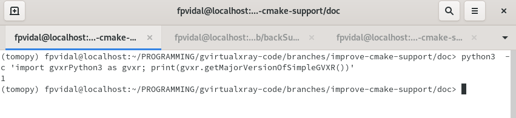
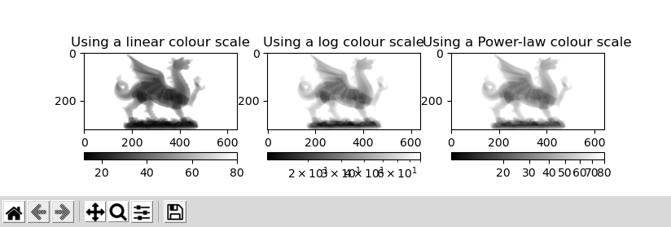
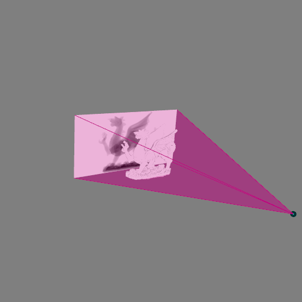
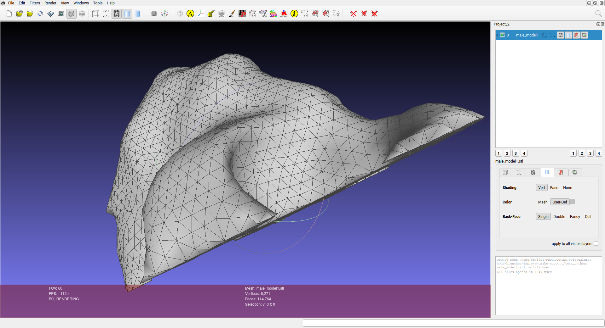
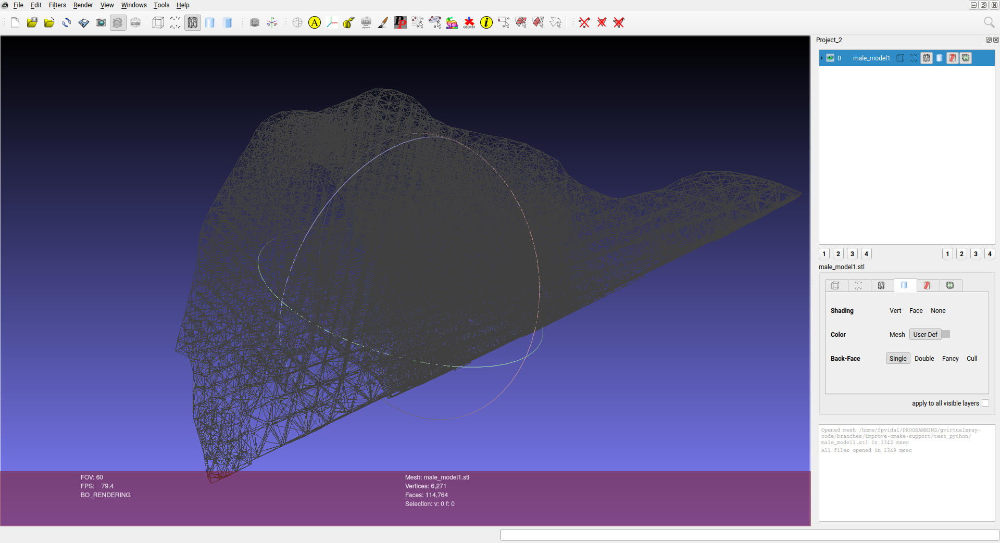
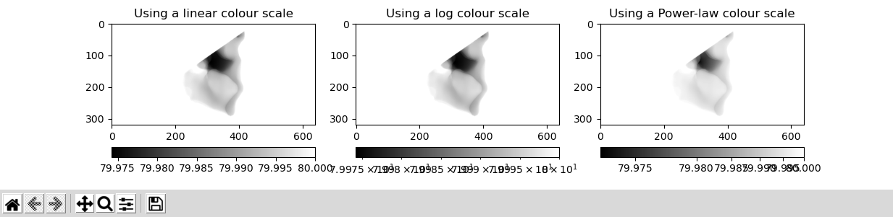
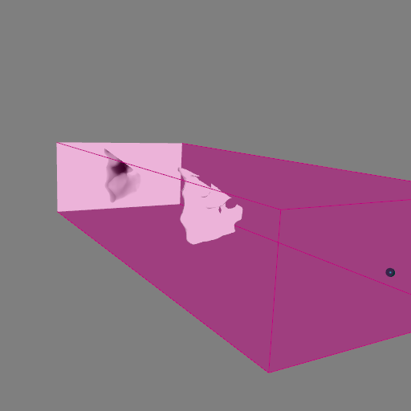
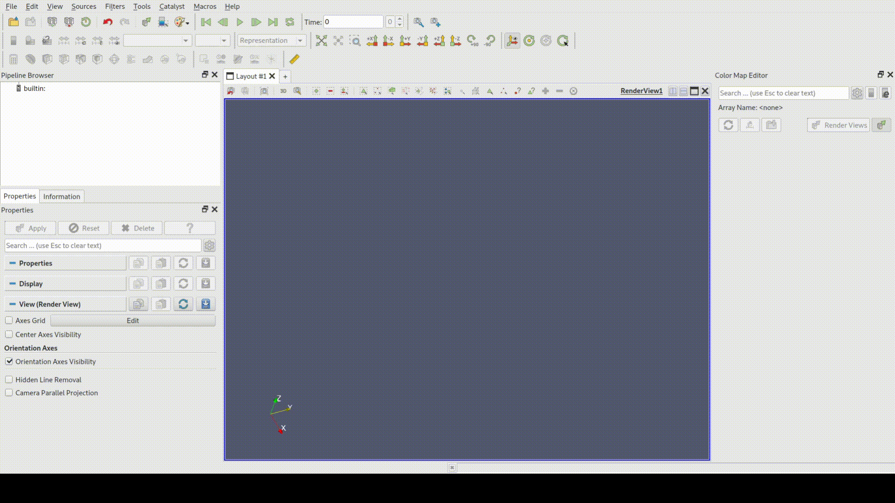

# Contents


- [Recordings](#Recordings)
- [Python scripts and STL file](#Python-scripts-and-STL-file)
- [Test if gvxrPython3 is well installed](#Test-if-gvxrPython3-is-well-installed)
- [Simulating an X-ray projection from a STL file](#Simulating-an-X-ray-projection-from-a-STL-file)
- [Simulating an X-ray projection from a INP file](#Simulating-an-X-ray-projection-from-a-INP-file)
- [CT reconstruction using tomopy](#CT-reconstruction-using-tomopy)
- [CT reconstruction using skimage](#CT-reconstruction-using-skimage)

# Recordings

- [Click here for a recording of `Simulating an X-ray projection from a STL file`](https://youtu.be/Y5q2kcuAZmY)

[](https://youtu.be/Y5q2kcuAZmY "Simulating an X-ray projection from a STL file")

- [Click here for a recording of `Simulating an X-ray projection from a INP file`](https://youtu.be/NeOnomO1N94)

[](https://youtu.be/NeOnomO1N94 "Simulating an X-ray projection from a INP file")

- [Click here for a recording of `Simulating a CT acquisition`](https://youtu.be/7c5oGgnCfEc)

[](https://youtu.be/7c5oGgnCfEc "Simulating a CT acquisition")

- [Click here for a recording of `Reconstructing a CT volume using tomopy`](https://youtu.be/iSvSslVpckQ)

[](https://youtu.be/iSvSslVpckQ "Reconstructing a CT volume using tomopy")

- [Click here for a recording of `Reconstructing a CT volume using skimage`](https://youtu.be/hb6Z3Y-2-YA)

[](https://youtu.be/hb6Z3Y-2-YA "Reconstructing a CT volume using skimage")


# Python scripts and STL file

- [Click here for the STL file of the Welsh dragon](welsh-dragon-small.stl)
- [Click here for the source code (X-ray projection from a STL file)](xray_proj_from_STL.py)
- [Click here for the source code (convert INP files to STL files)](inp2stl.py)
- [Click here for the source code (X-ray projection from an INP file)](xray_proj_from_INP.py)
- [Click here for the source code (X-ray CT acquisition)](ct_acquisition.py)
- [Click here for the source code (X-ray CT reconstruction using tomopy)](ct_reconstruction-tomopy.py)
- [Click here for the source code (X-ray CT reconstruction using skimage)](ct_reconstruction-skimage.py)


# Test if gvxrPython3 is well installed

To check that gvxrPython3 (SimpleGVXR's Python3 wrapper) is well compiled and installed, try the following command in the prompt:

```bash
$ python3  -c 'import gvxrPython3 as gvxr; print(gvxr.getMajorVersionOfSimpleGVXR())'
```

If you get the following error, it's because it is not installed properly or it cannot find gvxrPython3, refer to the instll guide in [Section 5](../5-install/README.html)

```python
Traceback (most recent call last):
  File "<string>", line 1, in <module>
ModuleNotFoundError: No module named 'gvxrPython3'
```

If you see the output message is `1`, then all is fine and you can proceed.




# Simulating an X-ray projection from a STL file

- Download a STL file

```bash
$ wget https://sourceforge.net/p/gvirtualxray/code/HEAD/tree/trunk/SimpleGVXR-examples/WelshDragon/welsh-dragon-small.stl
```

or [use the one provided in this directory](welsh-dragon-small.stl).


- Launch the Python interpreter and load the packages

```python
#!/usr/bin/env python3

try:
    import matplotlib
    matplotlib.use("TkAgg")

    import matplotlib.pyplot as plt
    import matplotlib.image as mpimg
    from matplotlib.colors import LogNorm
    from matplotlib.colors import PowerNorm
    use_matplotlib = True;
except ImportError:
    print("Matplotlib is not installed. Try to install it if you want to display and plot data.")
    use_matplotlib = False;

import gvxrPython3 as gvxr
```

- If Matplotlib is available, create the subplot first

```python
if use_matplotlib:
    plt.subplot(131)
```

- Create an OpenGL context

```python
gvxr.createWindow();
gvxr.setWindowSize(512, 512);
```

- Set up the beam

```python
gvxr.setSourcePosition(-40.0,  0.0, 0.0, "cm");
gvxr.usePointSource();
#gvxr.useParallelBeam();
gvxr.setMonoChromatic(0.08, "MeV", 1000);
```

- Set up the detector

```python
gvxr.setDetectorPosition(10.0, 0.0, 0.0, "cm");
gvxr.setDetectorUpVector(0, 0, -1);
gvxr.setDetectorNumberOfPixels(640, 320);
gvxr.setDetectorPixelSize(0.5, 0.5, "mm");
```

- Load the data

```python
gvxr.loadSceneGraph("welsh-dragon-small.stl", "mm");

# Get the label
label = gvxr.getChildLabel('root', 0);

# Move label to the centre
gvxr.moveToCentre(label);

# Move the mesh to the center
gvxr.moveToCenter(label);

# Set the material properties
gvxr.setHU(label, 1000);
```

- Compute an X-ray image and save it

```python
x_ray_image = gvxr.computeXRayImage();

gvxr.saveLastXRayImage("my_beautiful_dragon.mhd");
gvxr.saveLastXRayImage("my_beautiful_dragon.mha");
gvxr.saveLastXRayImage("my_beautiful_dragon.txt");
```

- Display the image with Matplotlib

```python
if use_matplotlib:
    plt.imshow(x_ray_image, cmap="gray");
    plt.colorbar(orientation='horizontal');
    plt.title("Using a linear colour scale");

    plt.subplot(132)
    plt.imshow(x_ray_image, norm=LogNorm(), cmap="gray");
    plt.colorbar(orientation='horizontal');
    plt.title("Using a log colour scale");

    plt.subplot(133)
    plt.imshow(x_ray_image, norm=PowerNorm(gamma=1./2.), cmap="gray");
    plt.colorbar(orientation='horizontal');
    plt.title("Using a Power-law colour scale");

    plt.show();
```



- Interactive visualisation of the 3D environment

```python
# Display the 3D scene (no event loop)
# Run an interactive loop
# (can rotate the 3D scene and zoom-in)
# Keys are:
# Q/Escape: to quit the event loop (does not close the window)
# B: display/hide the X-ray beam
# W: display the polygon meshes in solid or wireframe
# N: display the X-ray image in negative or positive
# H: display/hide the X-ray detector
gvxr.renderLoop();
```



or execute [`xray_proj_from_INP.py`](xray_proj_from_STL.py).


# Simulating an X-ray projection from a INP file

- Launch the Python interpreter and load the packages

```python
#!/usr/bin/env python3

import os, copy
import numpy as np
dir_path = os.path.dirname(os.path.realpath(__file__))

# Use Matplotlib
try:
    import matplotlib
    matplotlib.use("TkAgg")

    import matplotlib.pyplot as plt
    import matplotlib.image as mpimg
    from matplotlib.colors import LogNorm
    from matplotlib.colors import PowerNorm
    use_matplotlib = True;
except ImportError:
    print("Matplotlib is not installed. Try to install it if you want to display and plot data.")
    use_matplotlib = False;

import gvxrPython3 as gvxr
import inp2stl
```

- Define the NoneType

```python
NoneType = type(None);
```

- If Matplotlib is available, create the subplot first

```python
# Create the subplot first
# If called later, it crashes on my Macbook Pro
if use_matplotlib:
    plt.subplot(131)
```

- Create an OpenGL context

```python
print("Create an OpenGL context")
gvxr.createWindow();
gvxr.setWindowSize(512, 512);
```

- Set up the beam

```python
gvxr.setSourcePosition(-40.0,  0.0, 0.0, "cm");
#gvxr.usePointSource();
gvxr.useParallelBeam();
gvxr.setMonoChromatic(0.08, "MeV", 1000);
```

- Set up the detector

```python
gvxr.setDetectorPosition(40.0, 0.0, 0.0, "cm");
gvxr.setDetectorUpVector(0, 0, -1);
gvxr.setDetectorNumberOfPixels(640, 320);
gvxr.setDetectorPixelSize(0.5, 0.5, "mm");
```


- Load the data from the INP file

```python
vertex_set, triangle_index_set, material_set = inp2stl.readInpFile('male_model.inp', True);
#inp2stl.writeStlFile("male_model.stl", vertex_set, triangle_index_set[0]);
```





- Get the bounding box

```python
min_corner = None;
max_corner = None;

vertex_set = np.array(vertex_set).astype(np.float32);

for triangle in triangle_index_set[0]:
    for vertex_id in triangle:


        if isinstance(min_corner, NoneType):
            min_corner = copy.deepcopy(vertex_set[vertex_id]);
        else:
            min_corner[0] = min(min_corner[0], vertex_set[vertex_id][0]);
            min_corner[1] = min(min_corner[1], vertex_set[vertex_id][1]);
            min_corner[2] = min(min_corner[2], vertex_set[vertex_id][2]);

        if isinstance(max_corner, NoneType):
            max_corner = copy.deepcopy(vertex_set[vertex_id]);
        else:
            max_corner[0] = max(max_corner[0], vertex_set[vertex_id][0]);
            max_corner[1] = max(max_corner[1], vertex_set[vertex_id][1]);
            max_corner[2] = max(max_corner[2], vertex_set[vertex_id][2]);

# Compute the bounding box
bbox_range = [max_corner[0] - min_corner[0],
    max_corner[1] - min_corner[1],
    max_corner[2] - min_corner[2]];

# print("X Range:", min_corner[0], "to", max_corner[0], "(delta:", bbox_range[0], ")")
# print("Y Range:", min_corner[1], "to", max_corner[1], "(delta:", bbox_range[1], ")")
# print("Z Range:", min_corner[2], "to", max_corner[2], "(delta:", bbox_range[2], ")")
```


- Centre the mesh

```python
for vertex_id in range(len(vertex_set)):
    vertex_set[vertex_id][0] -= min_corner[0] + bbox_range[0] / 2.0;
    vertex_set[vertex_id][1] -= min_corner[1] + bbox_range[1] / 2.0;
    vertex_set[vertex_id][2] -= min_corner[2] + bbox_range[2] / 2.0;
```

- Load the mesh ion the GPU memory

```python
gvxr.makeTriangularMesh("male_model",
		np.array(vertex_set).astype(np.float32).flatten(),
		np.array(triangle_index_set).astype(np.int32).flatten(),
	    "m");
```

- The model is made of Hydrogen

```python
gvxr.setElement("male_model", "H");
```

- Add the mesh to the simulation

```python
gvxr.addPolygonMeshAsInnerSurface("male_model");
```

- Compute an X-ray image and save it

```python
x_ray_image = gvxr.computeXRayImage();

gvxr.saveLastXRayImage("male_model.mhd");
gvxr.saveLastXRayImage("male_model.mha");
gvxr.saveLastXRayImage("male_model.txt");
```

- Display the image with Matplotlib

```python
if use_matplotlib:
    plt.imshow(x_ray_image, cmap="gray");
    plt.colorbar(orientation='horizontal');
    plt.title("Using a linear colour scale");

    plt.subplot(132)
    plt.imshow(x_ray_image, norm=LogNorm(), cmap="gray");
    plt.colorbar(orientation='horizontal');
    plt.title("Using a log colour scale");

    plt.subplot(133)
    plt.imshow(x_ray_image, norm=PowerNorm(gamma=1./2.), cmap="gray");
    plt.colorbar(orientation='horizontal');
    plt.title("Using a Power-law colour scale");

    plt.show();
```



- Interactive visualisation of the 3D environment

```python
# Display the 3D scene (no event loop)
# Run an interactive loop
# (can rotate the 3D scene and zoom-in)
# Keys are:
# Q/Escape: to quit the event loop (does not close the window)
# B: display/hide the X-ray beam
# W: display the polygon meshes in solid or wireframe
# N: display the X-ray image in negative or positive
# H: display/hide the X-ray detector
gvxr.renderLoop();
```



or execute [`xray_proj_from_INP.py`](xray_proj_from_INP.py).

# CT acquisition

It is basically the same as previously, but with a for loop to rotate the scanned object.

```python
projections = [];
for i in range(180):
    # Compute an X-ray image and add it to the list of projections
    projections.append(gvxr.computeXRayImage());

    # Save the X-ray image
    gvxr.saveLastXRayImage("male_model_projection_" + '{0:03d}'.format(i) + ".dcm");

    # Update the 3D visualisation
    gvxr.displayScene();

    # Rotate the model by 1 degree
    gvxr.rotateNode("male_model", 1, 0, 0, -1);
```


or execute [`ct_acquisition.py`](ct_acquisition.py).

# CT reconstruction using [tomopy](https://github.com/tomopy/tomopy)

It is fairly similar to the previous program, but

- I added a few extract packages:

```python
import math # for pi
import tomopy # for tomography reconstruction
import SimpleITK as sitk # for saving the CT volume
```

- Pixel spacing is now in a variable for future use

```python
spacing_in_mm = 0.5;
gvxr.setDetectorPixelSize(spacing_in_mm, spacing_in_mm, "mm");
```

- We store the rotation angles in radian in an array

```python
projections = [];
theta = [];

for i in range(360):
    # Compute an X-ray image and add it to the list of projections
    projections.append(gvxr.computeXRayImage());

    # Update the 3D visualisation
    gvxr.displayScene();

    # Rotate the model by 1 degree
    gvxr.rotateNode("male_model", 0.5, 0, 0, -1);

    # Add the corresponding angle
    theta.append(i * 0.5 * math.pi / 180);
```

- Convert the projections as a Numpy array

```python
projections = np.array(projections);
```

- Retrieve the total energy

```python
energy_bins = gvxr.getEnergyBins("MeV");
photon_count_per_bin = gvxr.getPhotonCountEnergyBins();

total_energy = 0.0;
for energy, count in zip(energy_bins, photon_count_per_bin):
    total_energy += energy * count;
```

- Perform the flat-field correction of raw data

```python
dark = np.zeros(projections.shape);
flat = np.ones(projections.shape) * total_energy;

projections = tomopy.normalize(projections, flat, dark)
```

- Calculate  -log(projections)  to linearize transmission tomography data

```python
projections = tomopy.minus_log(projections)
```

- Set the rotation centre

```python
rot_center = int(projections.shape[2]/2);
```

- Perform the reconstruction

```python
recon = tomopy.recon(projections, theta, center=rot_center, algorithm='gridrec', sinogram_order=False)
```

- Plot the slice in the middle of the volume

```python
plt.imshow(recon[int(projections.shape[1]/2), :, :])
plt.show()
```

- Save the volume

```python
volume = sitk.GetImageFromArray(recon);
volume.SetSpacing([spacing_in_mm, spacing_in_mm, spacing_in_mm]);
sitk.WriteImage(volume, 'recon.mhd');
```



or execute [`ct_reconstruction.py`](ct_reconstruction-tomopy.py).


# CT reconstruction using [skimage](https://scikit-image.org/docs/dev/auto_examples/transform/plot_radon_transform.html)

It is fairly similar to the previous program again, but using [skimage](https://scikit-image.org/docs/dev/auto_examples/transform/plot_radon_transform.html) rather than [tomopy](https://github.com/tomopy/tomopy).

- Change of package:

```python
import math # for pi
from skimage.transform import iradon, iradon_sart # for tomography reconstruction
import SimpleITK as sitk # for saving the CT volume
```

- This time the model is made of silicon carbide rather than hydrogen

```python
gvxr.setCompound("male_model", "SiC");

gvxr.setDensity("male_model",
                3.2,
                "g/cm3");
```

- theta stores the rotation angles in degrees rather than radians.

```python
theta.append(i * rotation_angle);
```

- Transformations from raw X-ray proejctions to sinograms are performed manually

```python
# Perform the flat-field correction of raw data
dark = np.zeros(projections.shape);
flat = np.ones(projections.shape) * total_energy;
projections = (projections - dark) / (flat - dark);

# Calculate  -log(projections)  to linearize transmission tomography data
projections = -np.log(projections)

# Resample as a sinogram stack
sinograms = np.swapaxes(projections, 0, 1);
```

- The CT reconstruction is performed slice by slice

```python
# Perform the reconstruction
# Process slice by slice
recon_fbp = [];
recon_sart = [];
slice_id = 0;
for sinogram in sinograms:
    slice_id+=1;
    print("Reconstruct slice #", slice_id, "/", number_of_angles);
    recon_fbp.append(iradon(sinogram.T, theta=theta, circle=True));

    # Two iterations of SART
    # recon_sart.append(iradon_sart(sinogram.T, theta=theta));
    # recon_sart[-1] = iradon_sart(sinogram.T, theta=theta, image=recon_sart[-1]);

recon_fbp = np.array(recon_fbp);
```

[skimage](https://scikit-image.org/docs/dev/auto_examples/transform/plot_radon_transform.html)'s CT reconstruction is much slower than [tomopy](https://github.com/tomopy/tomopy)'s', but it's readily available for any Python distribution...

or execute [`ct_reconstruction.py`](ct_reconstruction-skimage.py).


# Back to main menu

[Click here](../README.md)
