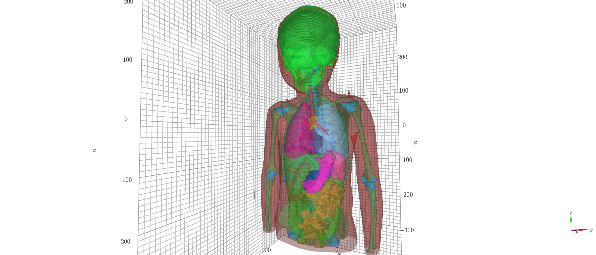
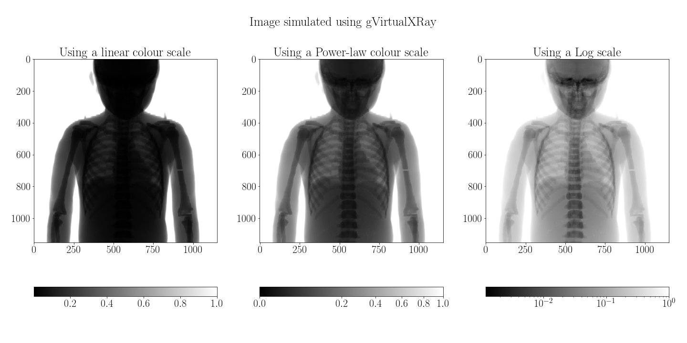

# Realistic simulation of X-ray radiographs using gVirtualXRay
## With a realistic beam spectrum and taking into account the energy response of the detector
### Authors: F. P. Vidal and J. M. Létang

**Purpose:** In this notebook, we aim to demonstrate how to use gVirtualXRay to generate analytic simulations on GPU. We take into account i) a realistic anatomical phantom, ii) a realistic clinical scenario, iii) a realistic beam spectrum,  and iv) the energy response of the detector.

**Material and Methods:** We downloaded the paediatric phantom from the [p**E**diat**R**ic dosimet**R**y personalized platf**OR**m (ERROR) project](https://error.upatras.gr/). It corresponds to the anatomy of a 5 year old boy. We generated surfaces meshes from the segmented data using [VTK](https://www.vtk.org/). We used the definitions of tissue substitutes provided in the [ICRU Report 44](https://www.icru.org/report/tissue-substitutes-in-radiation-dosimetry-and-measurement-report-44/) by the [International Commission on Radiation Units and Measurements](https://www.icru.org/). The material composition is available at [https://physics.nist.gov/PhysRefData/XrayMassCoef/tab2.html](https://physics.nist.gov/PhysRefData/XrayMassCoef/tab2.html).




In our simulation the source-to-object distance (SOD) is 1000mm, and the source-to-detector distance (SDD) is 1125mm. The beam spectrum is polychromatic. The voltage is 85 kV. The filteration is 0.1 mm of copper and 1 mm of aluminium. The energy response of the detector is considered. It mimics a 600-micron thick CsI scintillator.


**Results:** The X-ray image can be retrieved from the GPU and saved on the disk, or displayed using Matplotlib or others, using various look-up tables.



The calculations were performed on the following platform:

| OS | CPU | RAM | GPU |
|----|-----|-----|-----|
| Linux 5.3.18-150300.59.43-default, x86_64 | AMD Ryzen 7 3800XT 8-Core Processor | 63 GB | GeForce RTX 2080 Ti |


## Install Python and Jupyter using Conda

- Downlaod and install anaconda, Python and Jupyterlab

```
conda env create -f environment.yml
```

- Activate the Anaconda environment

```
conda activate gvxr-demo
```

- Download and install Spekpy, see [https://bitbucket.org/spekpy/spekpy_release/wiki/Home](https://bitbucket.org/spekpy/spekpy_release/wiki/Home) for details.

## Download and install gVirtualXRay

- You need [cmake](https://www.cmake.org) and a C++ compiler.
- Download gVirtualXRay from [the lastest branch](https://sourceforge.net/p/gvirtualxray/code/HEAD/tree/branches/better_support_of_GL_context/) and follow the instructions from [here](https://sourceforge.net/p/gvirtualxray/code/HEAD/tree/branches/better_support_of_GL_context/doc/5-install/).


## Launch the jupyter notebook

```
jupyter-lab
```

Alternatively, you can run the corresponding Python script

```
python3 pediatric-demo.py
```
